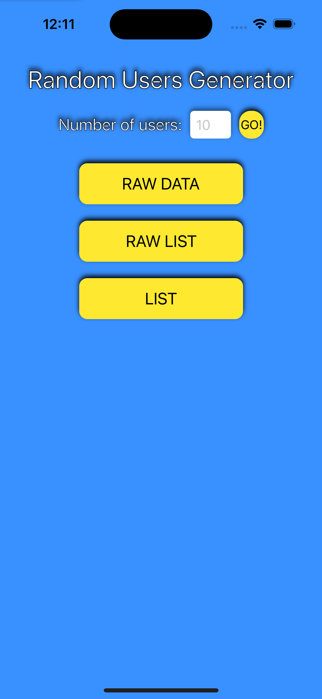

# Random Users Generator
*Por: Brian Jiménez Moedano*

*Mayo 2023*

## Descripción

**Random Users Generator** es una aplicación que se comunica con la **API** de *randomuser.me* para peticionar, recibir y presentar un número determiado de usuarios aleatorios. La presentación de la información recibida, lo hace de **tres** maneras diferentes: **Pretty JSON, lista simple, y una colección de imágenes y etiquetas.** Además, incorpora elementos dinámicos de la interfaz de usuario, a través de **animaciones y acondicionamiento en tiempo de ejecución**. El principal **objetivo y motivación** de la aplicación, es el **uso de peticiones HTTP, manejo de la información recibida, y control de hilos secundarios (para las peticiones remotas) e hilo principal (para la interfaz de usuario).**

## Características

- Aplicación que se conecta a la **API** de *randomuser.me* y presenta los resultados en distintos formatos.
- Diseño de arquitectura **MVC desacoplada** (controlador y UI).
- El usuario de la aplicación, determina la cantidad de usuarios aleatorios a generar.
- Tres maneras de presentar la información recibida: **Pretty JSON, lista simple, y una colección de imágenes y etiquetas.**
- Diseño de la interfaz dinámica y reactiva a los procesos que se llevan a cabo en los hilos secundarios.
- Uso del framework nativo **async/await** para las peticiones HTTP.
- Incorporación de **Pruebas Unitarias** para el **módulo que realiza las peticiones HTTP.**
- Implementa un patrón de diseño de **Inyección de Dependencias**.

## Cómo Utilizarla

Al abrir la aplicación, el usuario podrá especificar el **número de usuario aleatorios a generar**, o utilizar el número por **default** que es **10 (diez) usuarios**. Al presionar el botón de **"Go!"**, la interfaz de usuario se **bloqueará dinámicamente** y comenzará la ejecución del módulo que se comunica con la **API remota de randomuser.me**

Si la **comunicación falla**, la interfaz de usuario se desbloqueará parcialmente y anunciará el fallo con una **ventana emergente**, de igual manera lo hará si el **número de usuarios generados es demasiado alto como para presentarla en alguno de los formatos disponibles.**

Si la **comunicación es satisfactoria**, la interfaz de usuario de desbloqueará para permitir al usuario ver la información recibida en tres formatos distintos que a continuación se detallan:

1. **Pantalla Raw Data:** Desde esta pantalla el usuario puede visualizar la información en formato **Pretty JSON**.

2. **Pantalla Raw List:** Desde esta pantalla el usuario puede visualizar la información en formato de **lista**, así como acceder a la **pantalla de detalles** dando un **toque** a cualquiera de los usuarios.

3. **Pantalla List:** Desde esta pantalla el usuario puede visualizar la información en formato de **colección de imágenes y etiquetas**, así como acceder a la **pantalla de detalles** dando un **toque** a cualquiera de los usuarios.

4. **Pantalla de Detalles:** Desde esta pantalla el usuario puede visualizar la información detallada del usuario seleccionado.

Finalmente, la **aplicación es responsiva** a los cambios que el usuario haga sobre la **orientación de la pantalla del dispositivo**.

## Tecnologías/Frameworks

- **UIKit:** Para el diseño de la interfaz de usuario.
- **Inyección de Dependencias:** Para la comunicación de objetos entre vistas.
- **Async/Await:** Para las peticiones HTTP.
- **XCTest:** Para las pruebas unitarias del módulo que se comunica con la API.
- **randomuser.me:** Para la generación de usuarios aleatorios.
- **UIView.animation:** Para las animaciones de algunos elementos de la interfaz de usuario.

## Licenciamiento

- **GNU GPLv3**
